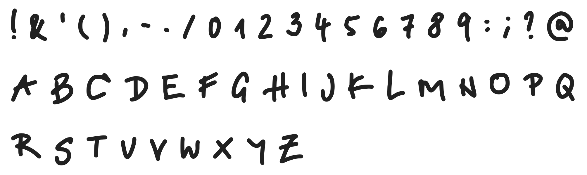

# Thold


**Thold** is a personal handwriting font. It captures a casual and bold style, designed to bring a human touch to digital projects.

Originally created from my own handwriting via Calligraphr and refined using FontForge, this font is now open-source and available for everyone to use.

## Preview

 

## Features

*   **Authentic Feel:** Based on real handwriting.
*   **Character Set:** Includes uppercase, numbers, and a selection of common punctuation.
*   **Open Source:** Licensed under the SIL Open Font License 1.1.

## Installation

### Windows
1. Download the `.ttf` or `.otf` file from the `fonts/` folder.
2. Right-click the file and select **Install**.

### macOS
1. Download the font file.
2. Double-click the file and click **Install Font** in the Font Book app.

### Linux
1. Move the font file to `~/.local/share/fonts`.
2. Run `fc-cache -f -v` in your terminal.

## Usage in Projects

You can use this font in any personal or commercial project under the terms of the SIL Open Font License. If you use it in a web project, you can include it via CSS:

```css
@font-face {
  font-family: 'Thold-Regular';
  src: url('path/to/[Thold-Regular.otf') format('opentype');
}
```

## License

This Font Software is licensed under the SIL Open Font License, Version 1.1.
See the `OFL.txt` file in this repository for the full license text.
